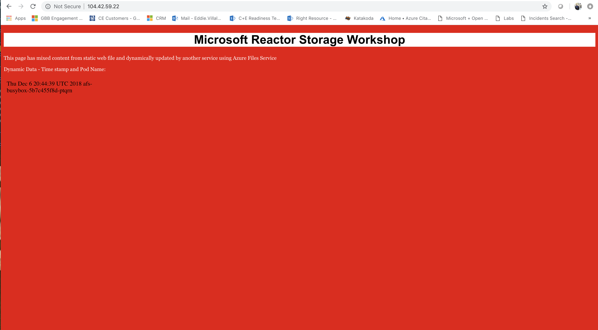
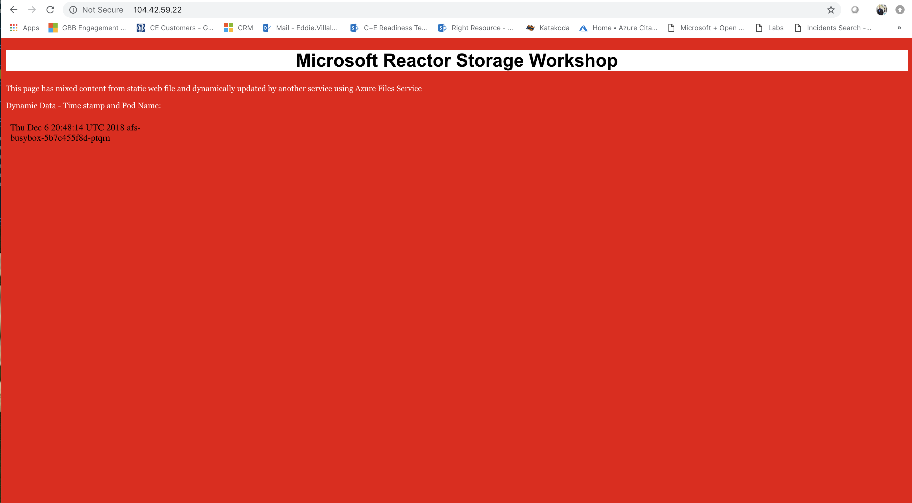

# Shared Storage using Azure Files

## How does Kubernetes use Storage

Applications that run in Azure Kubernetes Service (AKS) may need to store and retrieve data. For some application workloads, this data storage can use local, fast storage on the node that is no longer needed when the pods are deleted. Other application workloads may require storage that persists on more regular data volumes within the Azure platform. Multiple pods may need to share the same data volumes, or reattach data volumes if the pod is rescheduled on a different node. Finally, you may need to inject sensitive data or application configuration information into pods.

This lab introduces the core concepts that provide storage to your applications in AKS:

Storage classes
Persistent volumes
Persistent volume claims
Volumes

## Storage Classes

To define different tiers of storage, such as Premium and Standard, you can create a StorageClass. The StorageClass also defines the reclaimPolicy. This reclaimPolicy controls the behavior of the underlying Azure storage resource when the pod is deleted and the persistent volume may no longer be required. The underlying storage resource can be deleted, or retained for use with a future pod.

In AKS, two initial StorageClasses are created:

* default - Uses Azure Standard storage to create a Managed Disk. The reclaim policy indicates that the underlying Azure Disk is deleted when the pod that used it is deleted.
* managed-premium - Uses Azure Premium storage to create Managed Disk. The reclaim policy again indicates that the underlying Azure Disk is deleted when the pod that used it is deleted.
If no StorageClass is specified for a persistent volume, the default StorageClass is used. Take care when requesting persistent volumes so that they use the appropriate storage you need. You can create a StorageClass for additional needs using `kubectl`

To see the current Storage Classes available in your cluster:
```console
kubectl get storageclasses
```

**Output:**
```console
NAME                PROVISIONER                AGE
default (default)   kubernetes.io/azure-disk   50m
managed-premium     kubernetes.io/azure-disk   50m
```

## Create a StorageClass for Azure Files:

Container-based applications often need to access and persist data in an external data volume. If multiple pods need concurrent access to the same storage volume, you can use Azure Files to connect using the Server Message Block (SMB) protocol. AKS does not have a built in StorageClass for Azure files so we need to add it ourselves.

First we need need to enable the correct role-based access control (RBAC) role access to create secrets. AKS clusters use Kubernetes RBAC to limit actions that can be performed. Roles define the permissions to grant, and bindings apply them to desired users. For more information, see [Using RBAC authorization](https://kubernetes.io/docs/reference/access-authn-authz/rbac/).

To allow the Azure platform to create the required storage resources, create a ClusterRole and ClusterRoleBinding. Deploy the Role and Role binding yamls found in the manifest directory.

```console
kubectl apply -f manifests/azurefiles-rbac.yaml
```

**Output:**
```console
clusterrole.rbac.authorization.k8s.io/system:azure-cloud-provider created
clusterrolebinding.rbac.authorization.k8s.io/system:azure-cloud-provider created
```

A storage class is used to define how an Azure file share is created. A storage account can be specified in the class. If a storage account is not specified, a _skuName_ and _location_ must be specified, and all storage accounts in the associated resource group are evaluated for a match. For more information on Kubernetes storage classes for Azure Files, see [Kubernetes Storage Classes](https://kubernetes.io/docs/concepts/storage/storage-classes/#azure-file).

Apply the file azurefile-sc.yaml from the manifest folder. We will not define the storageAccount value so that Kubernetes will find or dynamically create a Storage account in the resource group of our cluster. For more information on mountOptions, see the [Mount options section](https://docs.microsoft.com/en-us/azure/aks/azure-files-dynamic-pv#mount-options).

```console
kubectl apply -f manifests/azurefile-sc.yaml
```

**Output:**
```
storageclass.storage.k8s.io/azurefile created
```

Verify the new storage class:

```console
kubectl get storageclasses
```

**Output:**
```
NAME                PROVISIONER                AGE
azurefile           kubernetes.io/azure-file   1m
default (default)   kubernetes.io/azure-disk   1h
managed-premium     kubernetes.io/azure-disk   1h
```

## Persistent Volumes

Pods often expect their storage to remain if a pod is rescheduled on a different host during a maintenance event, especially in StatefulSets. A persistent volume (PV) is a storage resource created and managed by the Kubernetes API that can exist beyond the lifetime of an individual pod.

A PersistentVolume can be statically created by a cluster administrator, or dynamically created by the Kubernetes API server. If a pod is scheduled and requests storage that is not currently available, Kubernetes can create the underlying Azure Disk or Files storage and attach it to the pod. Dynamic provisioning uses a StorageClass to identify what type of Azure storage needs to be created.

Since we created a StorageClass for Azure Files we will allow the Kubernetes API to dynamically create our PV.

## Persistent Volume Claims

A PersistentVolumeClaim (PVC) requests either Disk or File storage of a particular StorageClass, access mode, and size. The Kubernetes API server can dynamically provision the underlying storage resource in Azure if there is no existing resource to fulfill the claim based on the defined StorageClass. The pod definition includes the volume mount once the volume has been connected to the pod.

A PersistentVolume is bound to a PersistentVolumeClaim once an available storage resource has been assigned to the pod requesting it. There is a 1:1 mapping of persistent volumes to claims. Let's deploy a PVC for Azure Files and see the Persistent Volume (PV) is bound to the Persistent Volume Claim (PVC):

```console
kubectl apply -f manifests/afs-pvc.yaml
```

**Output:**
```
persistentvolumeclaim/afs created
```

Since the PVC is using the StorageClass the Kubernetes API is calling the Azure API to create the needed Storage Account and File share. It is also supplying the secret for the connection to the Azure Files.

Inspect the cluster, to determine if the PVC is created and bound:

```console
kubectl get pvc -w
```

**Output:**
```console
NAME   STATUS    VOLUME   CAPACITY   ACCESS MODES   STORAGECLASS   AGE
afs    Pending                                      azurefile      8s
afs    Bound    pvc-c8569cf8-f994-11e8-b237-5a95f74ed3f0   100Gi      RWX            azurefile      32s
```

Exit the watch by pressing `CTRL+C`

You can also determine the status of the Persistant Volume (PV) that was dynamically created:

```console
kubectl get pv
```

**Output:**
```console
NAME                                       CAPACITY   ACCESS MODES   RECLAIM POLICY   STATUS   CLAIM         STORAGECLASS   REASON   AGE
pvc-c8569cf8-f994-11e8-b237-5a95f74ed3f0   100Gi      RWX            Delete           Bound    default/afs   azurefile               9m
```
## Deploy a web service that uses the Azure Files Shared Storage

Next let's add two workloads to our AKS cluster that will leverage the Azure Files Persistent Volume:

```console
kubectl apply -f manifests/afs-writer.yaml
kubectl apply -f manifests/afs-test.yaml
```

**Output:**
```
deployment.apps/afs-writer created
deployment.apps/afs-web created
service/afs-web created
```

Great! The afs-writer service mounts the Azure File share as the `/mnt` directory in a busybox container and dynamically writes the current date and time and the name of the specific writer pod to a dyn.html file.

The afs-web service is an nginx web server that mounts the same Azure File share into the `/usr/share/nginx/html/dyn` directory and the index.html file has an iframe that calls the dynamic content that is written by the afs-writer deployment.

Let's view our web service

```console
kubectl get svc
```

**Output:**
```console
NAME         TYPE           CLUSTER-IP   EXTERNAL-IP    PORT(S)        AGE
afs-web      LoadBalancer   10.0.5.7     104.42.59.22   80:31164/TCP   4m
kubernetes   ClusterIP      10.0.0.1     <none>         443/TCP        2h
```
In this example case the web service is exposed to the internet via an Azure Public IP `104.42.59.22`. Please make sure to use your own IP and we can open a browser and go to the web service page:



Then refrsh the page after a few seconds to see the content in black changed



Next, let's [explore using Azure Disk for SQL data persistence](./03-sql-azuredisk.md).