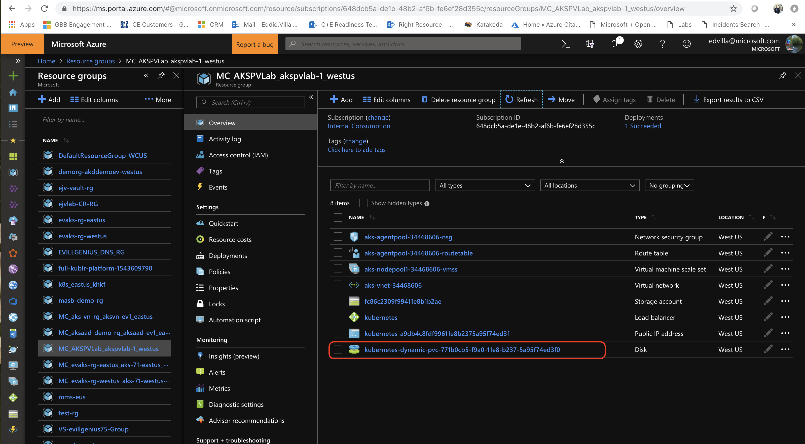

# Deploy a SQL Server container in Kubernetes with Azure Kubernetes Services (AKS)

Learn how to configure a SQL Server instance on Kubernetes in Azure Kubernetes Service (AKS), with persistent storage for high availability (HA). The solution provides resiliency. If the SQL Server instance fails, Kubernetes automatically re-creates it in a new pod. Kubernetes also provides resiliency against a node failure.

This tutorial demonstrates how to configure a highly available SQL Server instance in a container on AKS. You can also create [Always On availability groups for SQL Server containers](https://docs.microsoft.com/en-us/sql/linux/sql-server-ag-kubernetes?view=sqlallproducts-allversions). To compare the two different Kubernetes solutions, see [High availability for SQL Server containers](https://docs.microsoft.com/en-us/sql/linux/sql-server-linux-container-ha-overview?view=sqlallproducts-allversions).

## Create an SA password

Create an SA password in the Kubernetes cluster. Kubernetes can manage sensitive configuration information, like passwords as [secrets](https://kubernetes.io/docs/concepts/configuration/secret/).

The following command creates a password for the SA account:

```azurecli
kubectl create secret generic mssql --from-literal=SA_PASSWORD="MyC0m9l&xP@ssw0rd"
```  

Replace `MyC0m9l&xP@ssw0rd` with a complex password.

To create a secret in Kubernetes named `mssql` that holds the value `MyC0m9l&xP@ssw0rd` for the `SA_PASSWORD`, run the command.


## Create storage

Configure a [persistent volume](https://kubernetes.io/docs/concepts/storage/persistent-volumes/) and [persistent volume claim](https://kubernetes.io/docs/concepts/storage/persistent-volumes/#persistent-volume-claim-protection) in the Kubernetes cluster. Complete the following steps: 

1. Create a manifest to define the persistent volume claim.  The manifest specifies the storage provisioner, parameters, and [reclaim policy](https://kubernetes.io/docs/concepts/storage/persistent-volumes/#reclaiming). The Kubernetes cluster uses this manifest to create the persistent storage. 

The following yaml example defines a persistent volume claim. The storage class provisioner is `default`, because this Kubernetes cluster is in Azure it will use the built-in storage class that maps to Azure Standard Managed Disk. The storage account type is `Standard_LRS`. The persistent volume claim is named `mssql-data`. The persistent volume claim metadata includes an annotation connecting it back to the storage class. 

```yaml
kind: PersistentVolumeClaim
apiVersion: v1
metadata:
  name: mssql-data
  annotations:
    volume.beta.kubernetes.io/storage-class: default
spec:
  accessModes:
  - ReadWriteOnce
  resources:
    requests:
      storage: 8Gi
```

2. Create the persistent volume claim in Kubernetes.

```azurecli
kubectl apply -f manifests/sql-pvc.yaml
```

The persistent volume is automatically created as an Azure storage account, and bound to the persistent volume claim. 

```azurecli
kubectl get pvc
```

**Output:**
```console
NAME         STATUS   VOLUME                                     CAPACITY   ACCESS MODES   STORAGECLASS   AGE
afs          Bound    pvc-c8569cf8-f994-11e8-b237-5a95f74ed3f0   100Gi      RWX            azurefile      1h
mssql-data   Bound    pvc-771b0cb5-f9a0-11e8-b237-5a95f74ed3f0   8Gi        RWO            default        9s
```

3. Verify the persistent volume claim.

```azurecli
kubectl describe pvc <PersistentVolumeClaim>
```

`<PersistentVolumeClaim>` is the name of the persistent volume claim.

In the preceding step, the persistent volume claim is named `mssql-data`. To see the metadata about the persistent volume claim, run the following command:

```azurecli
kubectl describe pvc mssql-data
```
**Output:**
```console
Name:          mssql-data
Namespace:     default
StorageClass:  default
Status:        Bound
Volume:        pvc-771b0cb5-f9a0-11e8-b237-5a95f74ed3f0
Labels:        <none>
Annotations:   kubectl.kubernetes.io/last-applied-configuration:
                {"apiVersion":"v1","kind":"PersistentVolumeClaim","metadata":{"annotations":{"volume.beta.kubernetes.io/storage-class":"default"},"name":"...
            pv.kubernetes.io/bind-completed: yes
            pv.kubernetes.io/bound-by-controller: yes
            volume.beta.kubernetes.io/storage-class: default
            volume.beta.kubernetes.io/storage-provisioner: kubernetes.io/azure-disk
Finalizers:    [kubernetes.io/pvc-protection]
Capacity:      8Gi
Access Modes:  RWO
Events:        <none>
Mounted By:    <none>
```
The returned metadata includes a value called `Volume`. This value maps to the name of the blob.


The value for volume matches part of the name of the blob in the following image from the Azure portal: 



4. Verify the persistent volume.

```azurecli
kubectl describe pv <PersistentVolume>
```
`<PersistentVolume>` is the name of the persistent volume from the ouput of the prior command.

`kubectl` returns metadata about the persistent volume that was automatically created and bound to the persistent volume claim. 

**Output:**
```console
Name:            pvc-771b0cb5-f9a0-11e8-b237-5a95f74ed3f0
Labels:          <none>
Annotations:     pv.kubernetes.io/bound-by-controller: yes
                pv.kubernetes.io/provisioned-by: kubernetes.io/azure-disk
                volumehelper.VolumeDynamicallyCreatedByKey: azure-disk-dynamic-provisioner
Finalizers:      [kubernetes.io/pv-protection]
StorageClass:    default
Status:          Bound
Claim:           default/mssql-data
Reclaim Policy:  Delete
Access Modes:    RWO
Capacity:        8Gi
Node Affinity:   <none>
Message:
Source:
Type:         AzureDisk (an Azure Data Disk mount on the host and bind mount to the pod)
DiskName:     kubernetes-dynamic-pvc-771b0cb5-f9a0-11e8-b237-5a95f74ed3f0
DiskURI:      /subscriptions/648dcb5a-de1e-48b2-af6b-fe6ef28d355c/resourceGroups/MC_AKSPVLab_akspvlab-1_westus/providers/Microsoft.Compute/disks/kubernetes-dynamic-pvc-771b0cb5-f9a0-11e8-b237-5a95f74ed3f0
Kind:         Managed
FSType:
CachingMode:  None
ReadOnly:     false
Events:           <none>
```

## Create the deployment

In this example, the container hosting the SQL Server instance is described as a Kubernetes deployment object. The deployment creates a replica set. The replica set creates the pod. 

In this step, we will use a manifest to describe the container based on the SQL Server [mssql-server-linux](https://hub.docker.com/r/microsoft/mssql-server-linux/) Docker image. The manifest references the `mssql-server` persistent volume claim, and the `mssql` secret that you already applied to the Kubernetes cluster. The manifest also describes a [service](https://kubernetes.io/docs/concepts/services-networking/service/). This service is a load balancer. The load balancer guarantees that the IP address persists after SQL Server instance is recovered. 

1. Inspect the manifest (a YAML file) to describe the deployment. The following example describes a deployment, including a container based on the SQL Server container image.

```yaml
apiVersion: apps/v1beta1
kind: Deployment
metadata:
    name: mssql-deployment
spec:
    replicas: 1
    template:
      metadata:
        labels:
          app: mssql
      spec:
        terminationGracePeriodSeconds: 10
        containers:
        - name: mssql
          image: mcr.microsoft.com/mssql/server:2017-latest
          ports:
          - containerPort: 1433
          env:
          - name: MSSQL_PID
            value: "Developer"
          - name: ACCEPT_EULA
            value: "Y"
          - name: MSSQL_SA_PASSWORD
            valueFrom:
              secretKeyRef:
                  name: mssql
                  key: SA_PASSWORD 
          volumeMounts:
          - name: mssqldb
            mountPath: /var/opt/mssql
        volumes:
        - name: mssqldb
          persistentVolumeClaim:
            claimName: mssql-data
---
apiVersion: v1
kind: Service
metadata:
    name: mssql-deployment
spec:
    selector:
      app: mssql
    ports:
    - protocol: TCP
      port: 1433
      targetPort: 1433
    type: LoadBalancer
```

Of particular note are the following values: 

* MSSQL_PID `value: "Developer"`: Sets the container to run SQL Server Developer edition. Developer edition is not licensed for production data. If the deployment is for production use, set the appropriate edition (`Enterprise`, `Standard`, or `Express`). 

>**NOTE:**
>For more information, see [How to license SQL Server](https://www.microsoft.com/sql-server/sql-server-2017-pricing).

* `persistentVolumeClaim`: This value requires an entry for `claimName:` that maps to the name used for the persistent volume claim. This tutorial uses `mssql-data`. 

* `name: SA_PASSWORD`: Configures the container image to set the SA password, as defined in this section.

    ```yaml
    valueFrom:
    secretKeyRef:
        name: mssql
        key: SA_PASSWORD 
    ```

    When Kubernetes deploys the container, it refers to the secret named `mssql` to get the value for the password. 

>**NOTE:**
>By using the `LoadBalancer` service type, the SQL Server instance is accessible remotely (via the internet) at port 1433.

2. Create the deployment.

```azurecli
kubectl apply -f manifests/sqldeployment.yaml
```

**Output:**
```console
deployment.apps/mssql-deployment created
service/mssql-deployment created
```

The deployment and service are created. The SQL Server instance is in a container, connected to persistent storage.

To view the status of the pod, type `kubectl get pod`.

**Output:**
```console
NAME                                READY   STATUS    RESTARTS   AGE
afs-busybox-5b7c455f8d-54kfz        1/1     Running   0          17h
afs-busybox-5b7c455f8d-ptqrn        1/1     Running   0          17h
afs-web-5bffd969df-ltp6c            1/1     Running   0          17h
afs-web-5bffd969df-nkgch            1/1     Running   0          17h
mssql-deployment-7c5687bc5b-4szrs   1/1     Running   0          3m
```

In the preceding output, the pod has a status of `Running`. This status indicates that the container is ready. This may take several minutes.

>**NOTE:**
>After the deployment is created, it can take a few minutes before the pod is visible. The delay is because the cluster pulls the [mssql-server-linux](https://hub.docker.com/r/microsoft/mssql-server-linux/) image from the Docker hub. After the image is pulled the first time, subsequent deployments might be faster if the deployment is to a node that already has the image cached on it. 

3. Verify the services are running. Run the following command:

```azurecli
kubectl get services 
```

This command returns services that are running, as well as the internal and external IP addresses for the services. Note the external IP address for the `mssql-deployment` service. Use this IP address to connect to SQL Server. 

**Output:**
```console
NAME               TYPE           CLUSTER-IP   EXTERNAL-IP    PORT(S)          AGE
afs-web            LoadBalancer   10.0.5.7     104.42.59.22   80:31164/TCP     17h
kubernetes         ClusterIP      10.0.0.1     <none>         443/TCP          20h
mssql-deployment   LoadBalancer   10.0.3.170   40.83.167.38   1433:31794/TCP   5m
```
<!-- 
For more information about the status of the objects in the Kubernetes cluster, run:

```azurecli
az aks browse --resource-group <MyResourceGroup> --name <MyKubernetesClustername> --
```  
 -->
## Connect to the SQL Server instance and restore a Database

If you configured the container as described, you can connect with an application from outside the Azure virtual network. Use the `sa` account and the external IP address for the service. Use the password that you configured as the Kubernetes secret. 

You can use the following applications to connect to the SQL Server instance. 

* [SSMS](https://docs.microsoft.com/sql/linux/sql-server-linux-manage-ssms)

* [SSDT](https://docs.microsoft.com/sql/linux/sql-server-linux-develop-use-ssdt)

* [sqlcmd](https://docs.microsoft.com/en-us/sql/linux/sql-server-linux-setup-tools?view=sql-server-2017)

The Azure Cloud Shell includes sqlcmd so there is no need to install anything. To connect with `sqlcmd`, run the following command:

```cmd
sqlcmd -S <External IP Address> -U sa -P "MyC0m9l&xP@ssw0rd"
```
>**NOTE:**
>In the following steps replace the following values:
>   
>- `<External IP Address>` with the IP address for the `mssql-deployment` service 
>- `MyC0m9l&xP@ssw0rd` with your password if you changed it in the beginning of this lab

This tutorial uses the Wide World Importers sample database. Use the following steps to download and copy the Wide World Importers database backup file into your SQL Server container.

1. First, use `kubectl exec` to create a backup folder. The following command creates a /var/opt/mssql/backup directory inside the SQL Server pod.

```console
kubectl exec -it mssql-deployment-7c5687bc5b-4szrs mkdir /var/opt/mssql/backup
```

2. Next, download the WideWorldImporters-Full.bak file to your host machine.

```console
curl -L -o wwi.bak 'https://github.com/Microsoft/sql-server-samples/releases/download/wide-world-importers-v1.0/WideWorldImporters-Full.bak'
```

3. Use `kubectl cp` to copy the backup file into the container in the /var/opt/mssql/backup directory.

```console
kubectl cp wwi.bak <MSSQL_POD_NAME>:/var/opt/mssql/backup/wwi.bak
```

>**NOTE:**
>`<MSSQL_POD_NAME>` is the name of the pod you can copy from `kubectl get pods`

4. Run sqlcmd inside the pod to list out logical file names and paths inside the backup. This is done with the RESTORE FILELISTONLY Transact-SQL statement.

```console
sqlcmd -S <External IP Address> -U sa -P "MyC0m9l&xP@ssw0rd" -Q 'RESTORE FILELISTONLY FROM DISK = "/var/opt/mssql/backup/wwi.bak"' \   | tr -s ' ' | cut -d ' ' -f 1-2
```

**Output:**
```console
LogicalName   PhysicalName
------------------------------------------
WWI_Primary   D:\Data\WideWorldImporters.mdf
WWI_UserData   D:\Data\WideWorldImporters_UserData.ndf
WWI_Log   E:\Log\WideWorldImporters.ldf
WWI_InMemory_Data_1   D:\Data\WideWorldImporters_InMemory_Data_1
```

5. Call the RESTORE DATABASE command to restore the database inside the container. Specify new paths for each of the files in the previous step.

```console
sqlcmd -S <External IP Address> -U sa -P "MyC0m9l&xP@ssw0rd" -Q 'RESTORE DATABASE WideWorldImporters FROM DISK = "/var/opt/mssql/backup
/wwi.bak" WITH MOVE "WWI_Primary" TO "/var/opt/mssql/data/WideWorldImporters.mdf", MOVE "WWI_UserData" TO "/var/opt/mssql/data/WideWorldImporters_userdata.ndf", MOVE "WWI_Log" TO "/var/opt/mssql/data/WideWorldImporters.ldf", MOVE "WWI_InMemory_Data_1" TO "/var/opt/mssql/data/WideWorldImporters_InMemory_Data_1"'
```

**Output:**
```console
Processed 1464 pages for database 'WideWorldImporters', file 'WWI_Primary' on file 1.
Processed 53096 pages for database 'WideWorldImporters', file 'WWI_UserData' on file 1.
Processed 33 pages for database 'WideWorldImporters', file 'WWI_Log' on file 1.
Processed 3862 pages for database 'WideWorldImporters', file 'WWI_InMemory_Data_1' on file 1.
Converting database 'WideWorldImporters' from version 852 to the current version 869.
Database 'WideWorldImporters' running the upgrade step from version 852 to version 853.
____________________________SHORTENED FOR BREVITY_____________________________________
Database 'WideWorldImporters' running the upgrade step from version 868 to version 869.
RESTORE DATABASE successfully processed 58455 pages in 12.191 seconds (37.460 MB/sec).
```

6. Run a query to view the top 10 items in the Warehouse.StockItems table.

```console
sqlcmd -S <External IP Address> -U sa -P "MyC0m9l&xP@ssw0rd" -Q 'SELECT TOP 10 StockItemID, StockItemName FROM WideWorldImporters.Warehouse.StockItems ORDER BY StockItemID'
```

**Output:**
```console
StockItemID StockItemName----------- ----------------------------------------------------------------------------------------------------
          1 USB missile launcher (Green)
          2 USB rocket launcher (Gray)
          3 Office cube periscope (Black)
          4 USB food flash drive - sushi roll
          5 USB food flash drive - hamburger
          6 USB food flash drive - hot dog
          7 USB food flash drive - pizza slice
          8 USB food flash drive - dim sum 10 drive variety pack
          9 USB food flash drive - banana
         10 USB food flash drive - chocolate bar

(10 rows affected)
```

## Verify failure and recovery

To verify failure and recovery, you can delete the pod. Do the following steps:

1. List the pod running SQL Server.

```azurecli
kubectl get pods -o wide
```

Note the name and internal POD IP address of the pod running SQL Server.

2. Delete the pod.

```azurecli
kubectl delete pod mssql-deployment-0
```
`mssql-deployment-0` is the value returned from the previous step for pod name. 

Kubernetes automatically re-creates the pod to recover a SQL Server instance, and connect to the persistent storage. Use `kubectl get pods` to verify that a new pod is deployed. Use `kubectl get services` to verify that the IP address for the new container is the same. 

3. Connect to the database again and run a query to verify the data persisted

```console
sqlcmd -S <External IP Address> -U sa -P "MyC0m9l&xP@ssw0rd" -Q 'SELECT TOP 10 StockItemID, StockItemName FROM WideWorldImporters.Warehouse.StockItems ORDER BY StockItemID'
```

**Output:**
```console
StockItemID StockItemName----------- ----------------------------------------------------------------------------------------------------
          1 USB missile launcher (Green)
          2 USB rocket launcher (Gray)
          3 Office cube periscope (Black)
          4 USB food flash drive - sushi roll
          5 USB food flash drive - hamburger
          6 USB food flash drive - hot dog
          7 USB food flash drive - pizza slice
          8 USB food flash drive - dim sum 10 drive variety pack
          9 USB food flash drive - banana
         10 USB food flash drive - chocolate bar

(10 rows affected)
```

## Congratulations!

You've successfully used Azure Storage to provide persistent data stores for Kubernetes workloads in AKS. If you would like to learn how to create a more Fault Tolerant SQL 2019 cluster in Kubernetes using Kubernetes Operators and StatefuleSets please try your hand at the wallk through [Always On availability groups for SQL Server containers](https://docs.microsoft.com/en-us/sql/linux/sql-server-ag-kubernetes?view=sqlallproducts-allversions)